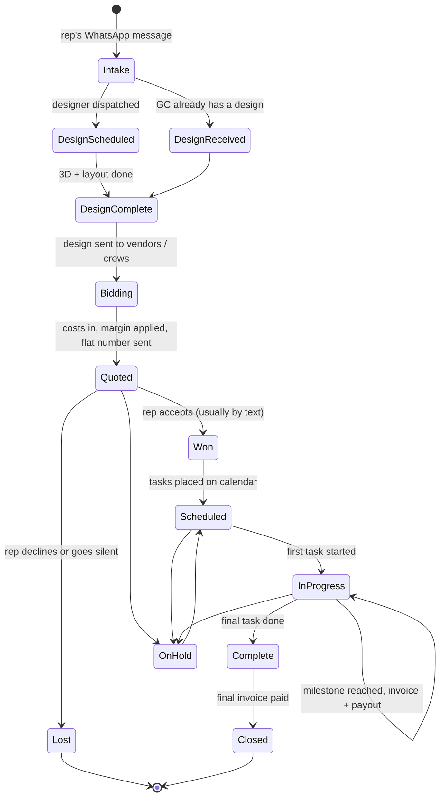

# 02 — Job lifecycle

Every job moves through the same spine regardless of type. The type only changes what happens
inside the execution phase.

## The spine



## Phase by phase

### 1. Intake

Trigger: a WhatsApp message from a sales rep — *"we just sold a job with a kitchen at this
address."* That is the whole of the input. There is no form, no PO, no drawing.

Minimum to create a project: client company, sales rep, job address. Everything else is unknown
and must be optional, including **job type** — the full-remodel vs install-only decision is made
after the design (Q2), so `undecided` is a legitimate and common starting state.

Two intake paths, both explicitly requested in Q2:

- **We design it** — dispatch a designer, often for the next day.
- **They have a design** — an "upload design" / "design completed" action that skips straight to
  `DesignComplete`.

### 2. Design

The design is the pivot point of the entire business. It fixes scope, it determines cost, and it
is what vendors price against. Q15: *"the design is fixed — we stay with that design. If there's
a change, then it's a change order."*

Two things happen here that are easy to miss:

- An **invoice goes out as soon as the designer is dispatched** (Q49) — before any work, before
  the job type is even known.
- The design's files become the most-retrieved artifact in the business. Q57: what they scroll
  WhatsApp for most is *"the design and prices."* Design files must be one click from the project
  and permanently attached, never buried in a chat.

### 3. Bidding

The design goes out to vendors and crews, who return prices. Today: a shared Google Sheet.
Tomorrow: the bid portal ([04](04-pricing-and-bidding.md)).

Note that both a cabinet vendor and a full-service crew may price the *same* design for
*different* scopes — the vendor for materials, the crew for the A-to-Z job. The model must not
assume one bid per project.

### 4. Quote

Selected bid costs, plus adjustments for distance and finish material, plus margin, collapse into
**one flat number** sent to the rep. Acceptance normally arrives as a WhatsApp reply, so the
system records approval channel and evidence rather than expecting a signature.

### 5. Scheduled → In progress

Work is placed on the calendar on a 1-day to 1-week horizon. Execution differs by type:

**Install only**

```
Cabinet install  ──►  Countertop install  ──►  Done
```
Frequently the same day — cabinets in the morning, countertops in the afternoon, because the
countertops are prefabricated (Q32).

**Full remodel**

```
Demo ──► Plumbing + electrical rough ──► Inspection ──► Cabinets ──► Countertops ──► Final
```
Five days at the fastest, about two weeks at the longest. The inspection is the only real gate.

Milestones fire as tasks complete: each one raises an invoice to the GC and a payout to the sub.

### 6. Complete → Closed

`Complete` = all work done. `Closed` = final invoice paid. Keeping these separate is what makes
the receivables view possible — a job can be finished and still owe money for weeks.

## Callbacks and rework

Q27: *"We pay for the fixes, but we don't need to track it... most of the time the sub will have
to take that hit."*

So rework is a task on the project, not a separate financial object. Log it, schedule it, do not
build cost attribution for it. This was an explicit "don't build this."

## Change orders

Scope added after the design is fixed. Path (Q51, Q52):

```
Crew finds extra work
      │  WhatsApp to owner
      ▼
Owner prices it and relays to rep
      │  WhatsApp
      ▼
Rep approves by text  ──►  change order approved  ──►  price and cost adjusted
```

Q54 says nothing goes unbilled today. The system's job is to keep that true as volume grows: an
approved change order must alter both the client price and the sub payout, and the approving text
should be captured on the record. Verbal-only approvals are the thing that starts leaking at 50
jobs a month.

## Statuses that must exist

| Status | Meaning |
| --- | --- |
| `intake` | Address known, nothing else |
| `design_scheduled` | Designer dispatched, first invoice out |
| `design_complete` | Design in hand (produced or supplied) |
| `bidding` | Out to vendors/crews for pricing |
| `quoted` | Flat number sent to rep, awaiting answer |
| `won` | Accepted |
| `lost` | Declined or dead |
| `scheduled` | Tasks on the calendar |
| `in_progress` | Work started |
| `complete` | All work done |
| `closed` | Paid in full |
| `on_hold` | Paused; reason recorded |

`on_hold` covers the case in Q31 — *"maybe we'll push a job off because another job needs more
attention"* — which is an internal prioritization decision, not an external blocker, and should
be visibly distinct from a failed inspection.
