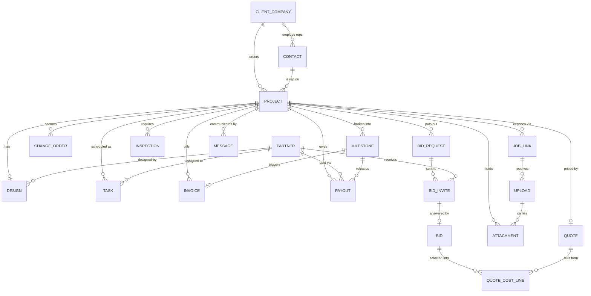

# 03 — Data model

Full DDL in [`db/schema.sql`](../db/schema.sql). This document explains the shape and the
reasoning behind the non-obvious choices.

## ERD



## The choices that matter

### Company and contact are separate

Q37 is unambiguous: clients are companies, and reps live inside them. Invoices go to
`client_company`; WhatsApp goes to `contact`. Reps change jobs; the company keeps owing the money.
Collapsing these into one record would break both billing and history.

`project.contact_id` records which rep owns *this* job, because one GC can have several reps
sending work independently.

### One `partner` table, not separate vendor and crew tables

Q16 describes the same design being priced by a cabinet vendor *and* by the A-to-Z crew. Both
are external parties who receive a design, return a price, and get paid. Splitting them into two
tables means duplicating the bid flow, the portal, and the payout logic for no gain.

`partner.type` (`cabinet_vendor`, `countertop_vendor`, `install_crew`, `full_service_crew`,
`designer`, `other`) distinguishes them, and one partner can hold several capabilities.

### `job_type` is nullable

The full-remodel vs install-only decision is made after the design. Forcing it at intake would
make the system lie during the phase where most jobs actually live. Default `undecided`.

### Bids are three tables, not one

```
BID_REQUEST   "price this design, for this scope, by this date"   (one per scope)
   └── BID_INVITE   one row per partner invited — carries the access token
          └── BID   the price that came back
```

This separation is what makes the portal work. The **invite** owns the tokenized URL and tracks
whether the partner opened it; the **bid** owns the number. It also makes "who did we ask and who
hasn't answered" a query instead of a memory exercise — which is the actual failure mode of the
Google Sheet.

### The quote holds cost and price, but only price is ever shown

`quote.cost_total` is assembled from selected bids plus adjustments; `quote.price` is the flat
number. Margin is stored as both a rule (`margin_type`, `margin_value`) and a resolved amount, so
that historical quotes stay accurate even if the rule changes later.

Nothing from `quote_cost_line` is ever rendered on a client-facing document. One-stop shop, one
number (Q11).

### Milestones drive both directions of money

A milestone is the single object that fires an invoice **out** to the GC and a payout **to** the
sub. Q25 describes exactly this symmetry: *"we pay in milestones... we break up the invoices
according to that."* Modeling them separately would let the two drift.

### Tasks are the calendar, inspections are their own thing

A `task` is a scheduled unit of work assigned to a partner in a date + slot. An `inspection` is
tracked separately because it has a pass/fail result, can be re-run, and is the only real
scheduling gate in the business (Q31). A failed inspection blocks downstream tasks; nothing else
does.

### Messages are records, not side effects

Every outbound communication is a row: drafted, reviewed, sent, with its template and its
audience. This is what makes the automation in [07](07-communications.md) reviewable — the owner
approves a queue of drafts rather than trusting a robot. It also means "did we tell the rep?"
stops being answered by scrolling.

### `job_link` is capability-based access

No accounts for crews. A `job_link` is an unguessable token scoped to one project, revocable,
optionally expiring. See [08](08-crew-job-links.md).

## Entity reference

| Table | Purpose | Notes |
| --- | --- | --- |
| `user_account` | Owners and data loggers | Role: `owner`, `logger`. Loggers can't see money. |
| `client_company` | The GC | Billable entity |
| `contact` | Sales rep | Phone is the WhatsApp identity |
| `partner` | Vendor, crew, or designer | Unified; `type` distinguishes |
| `project` | One kitchen at one address | The hub of everything |
| `design` | The fixed scope | `source`: `in_house` or `client_supplied` |
| `bid_request` | A scope put out for pricing | Has a due date |
| `bid_invite` | Partner invited to a bid request | Owns the portal token |
| `bid` | A returned price | Amount, lead time, notes |
| `quote` | The flat number to the GC | Plus internal cost build-up |
| `quote_cost_line` | Internal cost components | Never client-facing |
| `change_order` | Post-design scope change | Records approval channel + evidence |
| `milestone` | Payment/progress checkpoint | Drives invoice + payout |
| `milestone_template` | Per job type defaults | See [06](06-invoicing-and-payouts.md) |
| `task` | Scheduled work | Date + `am`/`pm`/`full_day` + partner |
| `inspection` | Permit inspection | Pass/fail, re-runnable |
| `invoice` | Money owed by the GC | Status drives the AR view |
| `payout` | Money owed to a partner | Mirrors milestones |
| `message` | Outbound comms | Draft → approved → sent |
| `message_template` | Reusable message bodies | Variable substitution |
| `job_link` | Tokenized per-job crew URL | Revocable |
| `upload` | What came in through a link | Photos, notes, extra-work reports |
| `attachment` | Any file | Polymorphic owner |
| `activity_log` | Audit trail | Who changed what |

## Deliberately not modeled

Things the answers explicitly ruled out. Building these would add weight with no user:

- **Homeowner records.** Master Kitchen never contacts them (Q37).
- **Rework cost attribution.** *"We don't need to track it"* (Q27).
- **Crew expense tracking.** Subs cover their own gas, tools, dump runs (Q26).
- **Per-trade subcontractor management.** One crew does A-to-Z (Q38).
- **Crew headcount / rosters.** *"I don't have a number... it doesn't really matter"* (Q21).
- **Inventory or materials catalog.** Vendors quote off the design; nothing is stocked.
- **Client-facing portal.** Reps will not log in (Q68). They get WhatsApp.
